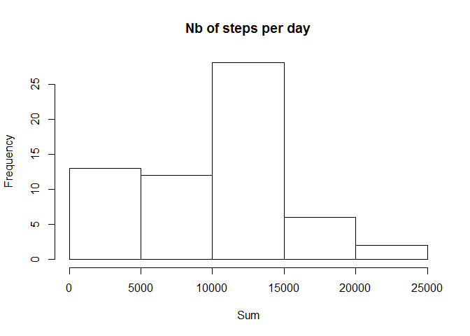
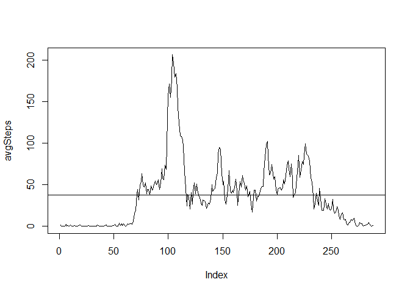
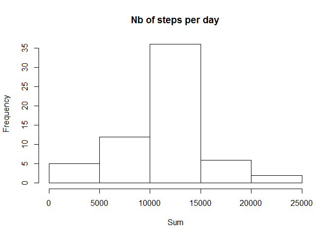
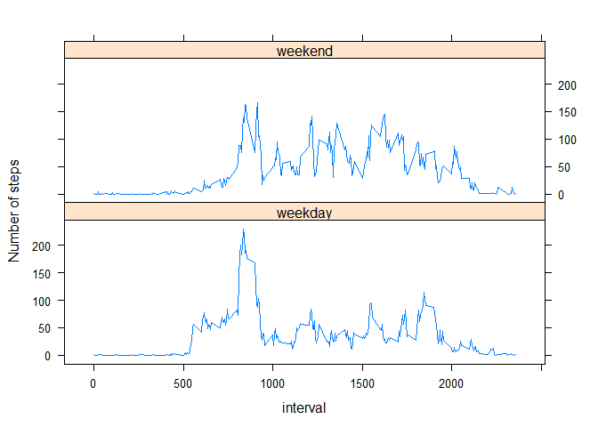

# Reproducible Research: Peer Assessment 1


## Loading and preprocessing the data

Here is the code to load the data :


```r
Sys.setlocale("LC_TIME", "English")
```

```
## [1] "English_United States.1252"
```

```r
setInternet2(use = TRUE)
download.file(url = "https://d396qusza40orc.cloudfront.net/repdata/data/activity.zip", destfile = "data.zip", mode = "wb")
```

```
## Warning in download.file(url =
## "https://d396qusza40orc.cloudfront.net/repdata/data/activity.zip", :
## taille téléchargée 53559 != taille déclarée 53559
```

```r
unzip("data.zip")
data <- read.csv(file = "activity.csv", sep = ",")
```


## What is mean total number of steps taken per day?

The histogram of the total number of steps taken each day :


```r
library(dplyr)
```

```
## 
## Attaching package: 'dplyr'
## 
## The following object is masked from 'package:stats':
## 
##     filter
## 
## The following objects are masked from 'package:base':
## 
##     intersect, setdiff, setequal, union
```

```r
sumTable <- data %>%
    group_by(date) %>%
    summarize(SumSteps = sum(steps, na.rm = TRUE))

hist(sumTable$SumSteps, xlab = "Sum", main = "Nb of steps per day")
```

 

The mean total number of steps taken per day is as follows :

```r
mean(sumTable$SumSteps)
```

```
## [1] 9354.23
```

The median total number of steps taken per day is as follows :

```r
median(sumTable$SumSteps)
```

```
## [1] 10395
```

## What is the average daily activity pattern?

Plot of the 5-minute interval averaged across all days :


```r
intervalTable <- data %>%
    group_by(interval) %>%
    summarize(avgSteps = mean(steps, na.rm = TRUE))

with(intervalTable, plot(avgSteps, type = 'l'))
abline(h = mean(intervalTable$avgSteps))
```

 

The maximum number of step is on average in the following interval :


```r
intervalTable$interval[which.max(intervalTable$avgSteps)]
```

```
## [1] 835
```

## Imputing missing values

1. The total number of missing values in the dataset is :


```r
sum(is.na(data$steps))
```

```
## [1] 2304
```

2. For filling in all of the missing values in the dataset, the chosen strategy is to replace NA values by the mean for that 5-minute interval

3. Let's create the dataset with missing data filled in :


```r
data2 <- data
for (i in 1:nrow(data2)) {
    if (is.na(data2$steps[i])){
        j <- which(intervalTable$interval == data2$interval[i]);
        data2$steps[i] <- floor(intervalTable$avgSteps[j]);
    }
}
```

4. The histogram of the total number of steps taken each day with the filled in data :


```r
sumTable2 <- data2 %>%
    group_by(date) %>%
    summarize(SumSteps = sum(steps, na.rm = TRUE))

hist(sumTable2$SumSteps, xlab = "Sum", main = "Nb of steps per day")
```

 

The mean total number of steps taken per day is as follows :

```r
mean(sumTable2$SumSteps)
```

```
## [1] 10749.77
```

The median total number of steps taken per day is as follows :

```r
median(sumTable2$SumSteps)
```

```
## [1] 10641
```

These values are **higher** than in the first part. So is the total daily number of steps.

## Are there differences in activity patterns between weekdays and weekends?

Here is the comparison of weekdays vs weekend activity :


```r
weekdaysvec <- weekdays(as.Date(data2$date))
weekdaysvec <- (weekdaysvec == "Saturday" | weekdaysvec == "Sunday")
weekdaysvec <- as.numeric(weekdaysvec) + 1
data2$daytype <- factor(weekdaysvec, labels = c("weekday", "weekend"))

intervalTable2 <- data2 %>%
    group_by(daytype, interval) %>%
    summarize(avgSteps = mean(steps))

library(lattice)
xyplot(avgSteps ~ interval | daytype, data = intervalTable2, layout = c(1,2), ylab = "Number of steps", type = "l")
```

 

